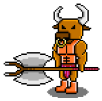
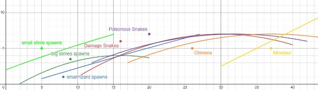

# Theseus: a Legend’s Rising

Jonathan Lin, Matthew Xu, and Hao Zheng

James E. Taylor High School

Future Business Leaders of America: Computer Game and Simulation Programming

 

## How to Run

MacOS
- Download `Theseus.dmg` from the above source code or download the entire project file
- Open/run the `Theseus.dmg` file
- Approve any security requests that your computer is requesting
- Once the dmg file window opens, double click the Theseus game icon

Windows
- Download `Theseus.exe` and `Theseus.pck` from the above source code or download the entire project file
- Ensure that `Theseus.exe` and `Theseus.pck` are in the same folder
- Open/run the `Theseus.exe` file
- Approve any security requests that your computer is requesting

Linux
- Ensure your Linux operating system is 64 bit
- Download `Theseus.x86_64` from the above source code or download the entire project file
- Open/run the `Theseus.x86_64` file
- Approve any security requests that your computer is requesting

## Background Information

Our game follows the story of Theseus and the Minotaur. In the Greek myth, fourteen-year-old Theseus was chosen by King Minos to be an annual sacrifice to the Minotaur, an abomination of a human with a bull’s head that was imprisoned in a labyrinth under Crete. The intricate labyrinth was constructed by Deadalus, a master engineer who was also responsible for the creation of the Minotaur. Rather than accepting his fate, Theseus, with the guidance of princess Ariadne, sought and defeated the Minotaur, cementing his position in Greek mythology as a warrior legend.

## Gameplay

The player plays as Theseus in his journey of traveling through the labyrinth to kill the Minotaur. To help gamify this experience, we added enemies (mythological Greek creatures, typical gaming monsters, etc) and bosses that the player faces in the mazes throughout the game.

## Controls

w | walk upward

a | walk left

s | walk downward

d | walk right

 

1 | fireball weapon select

2 | lightning weapon select

3 | freeze weapon select

mouse left-click | shoot the ranged weapon
mouse right-click | melee attack

 

shift key | sprint

space key | interact with signs and chests

ESC | pause the game

Arrow up key | walk upward (player 2)
Arrow down key | walk downward (player 2)
Arrow right key | walk right (player 2)
Arrow left key | walk left (player 2)

Enter key | shoot (player 2)

## Power-Ups: 

- Power ups can be found in chests: 
- Each power-up has two tiers: common and rare 
  - Rarity is rolled when a power-up is determined to be dropped
    - 80% common (silver icon), 20% rare (gold icon)

|Icons|Power Up|Power Up Effect|
|----|----|----|
||Wings|Common: +5% speed  Rare: +10% speed  *Maxes out at 200% speed, cannot be collected when reached|
||Health Canister|Common: +70 health if not at max health. +10 max health if at max health  Rare: +150 health if not at max health. +20 max health if at max health|
||Mana Canister|Common: +50 max mana  Rare: +100 max mana|
||Sword Cutler|Common: +7% melee damage  Rare: +20% melee damage|
||Ranged Eye|Common: +5% ranged damage  Rare: +15% ranged damage|

- Buffs are calculated by (weapon base damage x (1 + the sum of each buff percentage))

## Story Mode (Singleplayer)

The story/singleplayer mode is structured in different levels. Each level is a maze, and the player moves from left to right. Within the maze, the player will face a variety of monsters and a boss at the end of each level. The player has to defeat the boss to move on to the next level.

- Intro Cutscene:
  - Theseus is alone, running to the right
  - Dialogue (a voice in his head) encourages him to face his fears with courage
    - “Long ago, the Minotaur roamed the halls of the labyrinth under Crete… Searching for a way to escape…

King Minos of Crete…

Would sacrifice fourteen young men and women…

In order to appease the beast…”

- “*Theseus…*

*Slow down…*

*Fear is not something you must run from…*

*Fear is the foundation of hope…*

*The beating of your heart…*

*The fire that forges legends…*

- The player starts with 100 HP and 100 Mana
  - Mana regenerates over time
  - Health is only restored by powerups

There are 3 total mazes/levels in the game: The Nest, Glittering Scales, and the Final Hall.

- **Stage 1 - The Nest**
  - Mobs:
    - Greek rock lizards 
      - Shoots acid at player
    - Slimes 
      - Standard slime, pathfinds to the player 
    - Big Slimes 
      - Splits into multiple smaller slimes when defeated 
  - Boss: A Giant Lizard 
    - 2 attacks: 
      - Slap attack - knockback and high damage
      - Spit attack - projectile towards the player at a certain distance, spawns a slime at the end
- **Stage 2 - Glittering Scales**
  - Mobs:
    - Snakes
      - 2 types: damage and poison
      - Damage snake: deals immediate damage
      - Poison snake: deals damage over time
    - Chimeras
      - Lion, snake, goat hybrids
      - Lion pounces if the player is on the left
      - Goat charges if the player is on the right
  - Boss: Snake Goddess
    - Attacks:
      - Summoning snakes
      - Hits the player with her staff
- **Stage 3 - The Final Hall**
  - Mobs:
    - Spirits - The spirits are mobs that help the player by having a high chance to drop power-ups for the final fight: they spawn based on the number of previous mobs killed. At least one of each spirit will spawn.
    - All powerup drops are rare
      - Green Spirits
        - Spawns based on number of Slimes and Lizards killed
        - 75% to drop a Health Canister
        - 75% to drop a Sword Cutler
      - Red Spirits
        - Spawns based on number of Snakes killed 
        - 75% to drop a Ranged Eye 
      - Orange Spirits 
        - Spawns based on number of Chimeras killed 
        - 50% to drop wings 
        - 75% to drop a Mana Canister 
- Final Boss - The Minotaur
  - This boss will be very difficult, but possible to beat even if the player is not sufficiently upgraded
    - Charging attack
      - Significant knockback and damage
    - Axe attack
      - Stuns the player
    - Damage scales with how much health is left
- **Score Calculations**
  - The score is based on the total time taken for the player to complete the game.
  - The lower the score, the better.

## Endless Mode (Singleplayer)

The Endless mode is an infinite dungeon where the player seeks to progress as far as possible. There are unlimited levels. The number of enemies that spawn each level are calculated using the formulas below. After defeating all the enemies on the screen, the next wave’s enemies increase in health and power ups drop on the ground to help the player.

### The Math
*

- The graph above displays the number of each enemy that will spawn each level
- y-axis: the level number; y-axis: the number of enemies for that level
- To increase randomness, each of the spawn values are randomly multiplied up to ± 25% to further increase endless mode’s overall randomization

Endless Mode Formulas

|Enemy Formula|Formula|
|-------------|-------|
|Small Slimes|-0.4*9500(x+100)+40 {0<x<15}|
|Big Slimes|-0.02(x-16)^2+4 {2<x<20}|
|Small Lizards|3000/(-0.1(x+310)+96) {5<x<27}|
|Damage Snakes|-0.015(x-30)&2+7 {10<x<40}|
|Poisonous Snakes|-0.01(x-32)^2+7 {12<x<42}|
|Chimera|-0.015(x-37)^2+7 {17<x<50}|
|Minotaur|0.5(x-25) {30<x<50}|

## Online Multiplayer Mode

- Online multiplayer allows people from across the world to battle each other in real time.
- In a normal 1v1 Player v.s. Player game, the server processes 840 packets per second and maintains a ping of 10 milliseconds. After stress testing, the server can handle 50 concurrent players while still maintaining an acceptable ping.

## Online Multiplayer Server

What

- Our online multiplayer server handles the real time combat, collision detection, and data processing for the online multiplayer game mode.
- Our system utilizes server side processing to prevent hacking. If the server detects abnormal player behavior that indicates hacking, the server will override and correct the client.

Why

- We created this mode because we found that video games were most fun when playing with friends. This mode allows people from across the world to play and compete with each other.

How

- The server receives connections from clients - instances of Theseus. The server stores all the information that the clients are sending it, processes collisions, processes location data, and sends the information back to all the clients.
- Our server is also configured so that it can be deployed on any Virtual Private Server (VPS), such as Amazon AWS, Microsoft Azure, and Google Cloud Platform.

## Local PvP Multiplayer Mode

The Multiplayer mode is a PvP fireball-only environment where two players seek to defeat their opponent. Players get points for defeating their opponent. Players respawn with full health and mana. The two players use a different set of movement and weapon controls on the same keyboard to battle each other. An internet connection is **not** required for this mode.

## Database

What

- We set up an external server hosted on Repl to hold the data for the leaderboard. The leaderboard can be accessed from any device with an internet connection.

Why

- This allows players to compete against one another from across the world. And if the player does not have an internet connection, there is an error retrieving information from the server, or the server is offline, then the game will simply use a local backup file for the leaderboard information.

How

- Our server is hosted for free on Repl. We used Django and Python to create an Application Programming Interface (API) to handle HTTP requests from the game. The game uses GET HTTP requests to communicate with the server.

## Source Code Layout
- The folder `Theseus` contains the source code for the client (game).
- The folder `Theseus_Leaderboard_Server` contains the code for the leaderboard database.
- The folder `Theseus_Multiplayer_Server` contains the code for the online multiplayer server.

## Why Godot

- Free and open source - Godot is both free and open source, allowing us to modify the game engine if needed. And since Godot is built using Godot, we can go into its source code and learn new things. There is also a very strong and healthy community around Godot always willing to help.
- Copyright and intellectual property policy - We are given full rights to anything produced with the game engine. This means that there are no licensing fees, royalty fees, etc.
- Lightweight - Godot is extremely lightweight compared to most game engines, such as Unity and Unreal Engine. With a size of less than 100 MB, we can easily download Godot on any computer and modify our game on the fly. Additionally, the game does not require heavy computing power to run.
- Node system - The node system allows more effective organization and is a powerful tool for creating large scale games. We can create only one object for a type of enemy, and then easily work in a modular fashion to duplicate the same type of enemies across different levels. The node system was also utilized by our team to create custom abstract classes that we could add onto similar object classes.

## Asset Ownership

- All artwork, sprites, and animations are original to the team, made in Aseprite
- All music is original to the team, made in Logic Pro
- The shooting sound effects were legally sourced from Cymatics or Mixkit
  - https://cymatics.fm/
  - https://mixkit.co/license/#sfxFree

## Platforms

- Our game can run on MacOS, Windows, and Linux
- Files needed
  - Windows: Theseus.exe and Theseus.pck
  - MacOS: Theseus.dmg
  - Linux: Theseus.x86\_64

## How To Deploy Online Multiplayer

### Local Area Network (LAN)
- Run `Theseus_Multiplayer_Server.exe` on a Windows computer
- Navigate to the `Server.gd` file of the Theseus client source code
- Change the IP variable in `Server.gd` to the local IP address of your network
- Export the client through Godot
- Now running online multiplayer mode in the exported client from any computer connected to the same network will join the same server

### Virtual Private Server (VPS)
- Deploy `Theseus_Multiplayer_Server.exe` - the process will differ depending on the specific VPS
- Navigate to the `Server.gd` file of the Theseus client source code
- Change the IP variable in `Server.gd` to the IP address of your VPS
- Export the client through Godot
- Now running the new exported client will connect the server that is being hosted on your VPS
